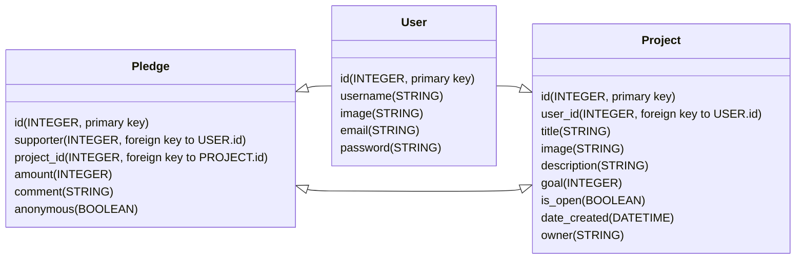

#### Crowdfunding Project

# GoodGo


GoodGo is a crowdfunding platform that aims to support the Ukrainian people and their fight against Russian aggression. The platform is designed to connect individuals and organizations who wish to make a difference in the community by supporting projects and initiatives that address the challenges caused by the ongoing conflict. The platform targets volunteers who are actively working to restore normalcy in the de-occupied territories, providing assistance to those affected by the conflict, and supporting the efforts of those who are fighting to defend democratic values, human rights, and peace. GoodGo is a great way for people to make a real impact in the community and to support the Ukrainian people in their time of need. Whether it's by donating, volunteering, or starting their own project, GoodGo empowers individuals to make a difference.

### The features my MVP will include:

- Ability to create, login/logout user accounts
- Ability to create a “project” to be crowdfunded
- Project listing and browsing
- Ability to “pledge” to a project
- Implement suitable update/delete projects functionality

### Additional features I would like to include:

- Commenting system - would allow users to leave comments on projects. This feature could also be used as a way of answering questions and doubts.
- Search function - would allow users to search for projects based on keywords
- Add the ability to “favourite” project and see a page with your favourite projects.

### An API specification:

<details><summary>Operations about user</summary>

#### Register a new user

<details><summary>POST /users/register</summary>
Request Body:

```
{
    "username": "johndoe",
    "image": "",
    "email": "johndoe@example.com",
    "password": "password123"
}
```

Success Response:
Code: 201
Content:

```
{
    "id": 1,
    "username": "johndoe",
    "email": "johndoe@example.com"
}
```

</details>

#### Login a user

<details><summary>POST /users/login</summary>
  Request Body:

```
{
    "email": "johndoe@example.com",
    "password": "password123"
}
```

Success Response:
Code: 200
Content:

```
{
    "token": "..."
}
```

</details>

#### Get user info

<details><summary>GET /user/:id</summary>
  Success Response:
  Code: 200
  Content:

```
[
    {
       "id": 1,
        "username": "johndoe",
        "image": "...",
        "email": "johndoe@example.com"
    }
```

</details>

#### Edit user info

<details><summary>PATCH /user/:id</summary>

</details>
</details>

<details><summary>Everything about Projects</summary>

#### Get all projects

<details><summary> GET /projects</summary>
  Success Response:
  Code: 200
  Content:

```
[
    {
        "id": 1,
        "user_id": 1,
        "title":
```

</details>

#### Create a new project

<details><summary>POST /projects</summary>
  Headers:

```
{
    "Authorization": "<access_token>"
}
```

Request Body:

```
{
	"title": "Project one",
	"description": "The first project.",
	"goal": 150,
	"image": "https://via.placeholder.com/300.jpg",
	"is_open": true,
	"date_created": "2020-03-20T14:28:23.382748Z",
	"owner": "Real Creator"
}
```

Success Response:
Code: 201
Content:

```
{
	"id": 1,
	"title": "Project one",
	"description": "The first project.",
	"goal": 150,
	"image": "https://via.placeholder.com/300.jpg",
	"is_open": true,
	"date_created": "2023-01-14T00:12:48.268589Z",
	"owner": "Real Creator"
}
```

</details>

#### Get project detail

<details><summary>GET /projects/:id</summary>
  Success Response:
  Code: 200
  Content:

```
{
	"id": 1,
	"title": "Project one",
	"description": "The first project.",
	"goal": 150,
	"image": "https://via.placeholder.com/300.jpg",
	"is_open": true,
	"date_created": "2023-01-14T00:12:48.268589Z",
	"owner": "Real Creator"
}
```

</details>

#### Edit project

<details><summary>PATCH /projects/:id </summary>

</details>

#### Delete project

<details><summary>DELETE /projects/:id</summary>

</details>
</details>

<details><summary>Everything about Pledges</summary>

#### Create a new pledge

<details><summary> POST /pledges</summary>
  Request Body:

```
{
	"amount": 10,
	"comment": "hope it helps",
	"anonymous": false,
	"supporter": "Real Creator",
	"project_id": 1
}
```

Success Response:
Code: 201
Content:

```
{
	"id": 1,
	"amount": 10,
	"comment": "hope it helps",
	"anonymous": false,
	"supporter": "Real Creatore",
	"project_id": 1
}
```

</details>

#### Get pledges

<details><summary>GET /pledges</summary>
  Success Response:
  Code: 200
  Content:

```
[
	{
		"id": 1,
	    "amount": 10,
	    "comment": "hope it helps",
	    "anonymous": false,
	    "supporter": "Real Creatore",
	    "project_id": 1
	}
]
```

</details>

#### Edit pledge

<details><summary> PATCH /pledges/:id</summary>

</details>

#### Delete pledge

<details><summary>DELETE /pledges/:id</summary>

</details>
</details>

### A database schema:



### Colour Scheme


### Heading and body font

[Quicksand](https://fonts.google.com/specimen/Quicksand?query=Qui#styles)

<!---
<link rel="preconnect" href="https://fonts.googleapis.com">
<link rel="preconnect" href="https://fonts.gstatic.com" crossorigin>
<link href="https://fonts.googleapis.com/css2?family=Quicksand:wght@300;500&display=swap" rel="stylesheet">

CSS rules to specify families:
font-family: 'Quicksand', sans-serif;

>
